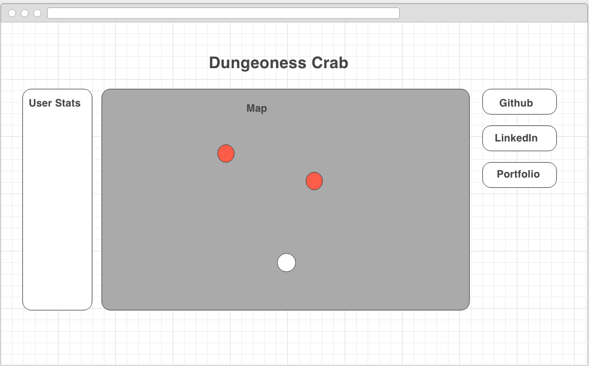

# Dungeoness Crab

## Background

Dungeoness Crab is a rogue-like hack and slash game built using React.js, HTML, and CSS. The idea is to have a character that explores a randomly generated dungeon and fights monsters. As the character goes deeper in the dungeon, the monsters would get exponentially more difficult. Characters will gain experience and grow in strength linearly depending on the number of monsters and the difficulty of the monster they kill. Users will be able to save their characters every X levels in order to have progression.

## MVP

- [ ] Start / Restart game
- [ ] Modal with directions
- [ ] User character with health / attack
  - [ ] User character gains strength/health after level
- [ ] Enemy characters with health / attack (exponential to level)
  - [ ] Enemy characters give exp after death

## Wireframe

This app will consist of a single screen with a game board, user statistics, and nav links to the Github, my LinkedIn, and an About modal.

</img>

## Architecture and Technologies

This project will be created with the following technologies:

- JavaScript will be used for the overall structure and game logic.
- `Easel.js` with `HTML5 Canvas`
- Webpack will be used to bundle and serve up the various scripts

In addition to the webpack entry file, there will be the follwing:
`board.js`: this script will handle the logic of creating and updating the `Easel.js` elements and rendering them to the DOM

`map.js`: this script will be responsible for building the level map and keep track of the level number. The map will be made up of cells.

`cell.js`: this scrip will keep track of type of cell this is and what it contains (enemy, empty, user, wall)

`user.js`: this script will handle the player input logic and keep track of the player's stats

`enemy.js`: this script will handle the enemy random movement logic and keep track of the enemy's stats.

## Implementation Timeline

### Day 1:
Setup all necessary Node modules, including getting webpack up and running and `Easel.js` installed. Create `webpack.config.js` as well as `package.json`. Write a basic entry file and the barebones of all 4 scripts outlined above. Learn the basics of `Easel.js`. Goals for the day:

- Get initial setup
- Learn enough `Easel.js` to render an object to the Canvas element.
- Have the user and enemy stats
- Develop the algorithm for increasing the User's stats and the Enemy's stats

### Day 2:
This day will be to really dive deep into `Easel.js` API. I should develop a random generation algorithm for building a map / maze.

- Build `map.js` module (constructor, update functions)
- Build `cell.js` module (constructor, update functions)
- Render a rectangular grid to the Canvas using Easel.js

### Day 3:
Create the `enemy.js` movement logic and the `user.js` input api.
Build out the functions for user movement and enemy movement. Build out the fight animation between the enemy and user.

- Finish building out `enemy.js`
- Finish building out `user.js`
- User should be able to look around the map by dragging.
- User moves via `wasd` input

## Bonus
- [ ] Use Rails Lite to implement a backend
- [ ] Save progression after X levels
- [ ] Items to boost User's health / attack
- [ ] Different enemy types
- [ ] Leaderboard
